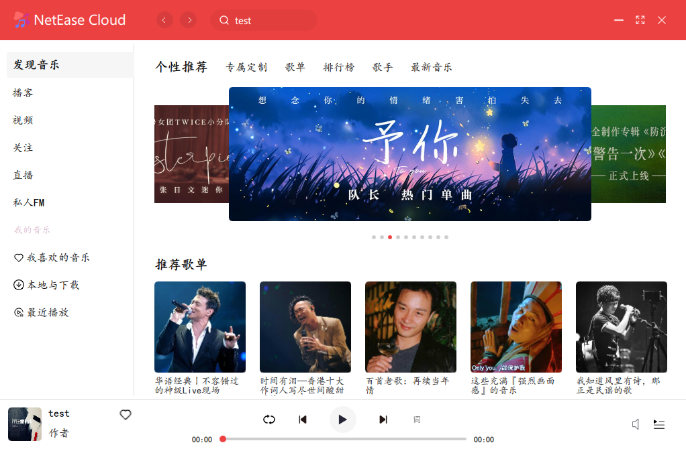
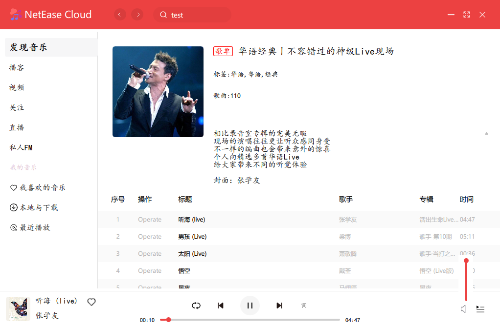

# NetEaseCloudDemo

###### 使用qml编写的仿网易云音乐demo

# start

1. clone repo [https://github.com/buildingZL/NetEaseCloudDemo.git](https://github.com/buildingZL/NetEaseCloudDemo.git)
2. install docker and run the images[[binaryify/netease_cloud_music_api](https://neteasecloudmusicapi.vercel.app/#/)]
3. open Qt project and run  project

# environment
- window10 64
- compiler:mingw810_64
- Qt version:Qt5.15.2

# test picture

主页

歌单页面

音量控制

